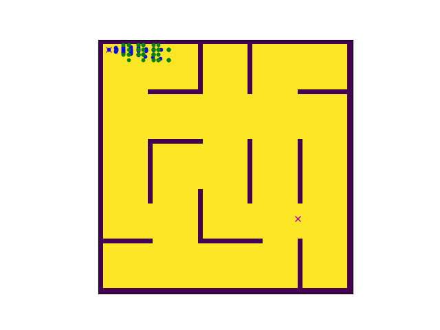

# A* Path Planning based Maze Solver

# Introduction
This code generates a randomized maze of a specified size and given the start and goal nodes solves the maze to generate a suboptimal path using A* algorithm. The code is written to assist understanding of use of python datastructure to reduce execution time to solve a popular path planning algorithm.

## Demo
Demo 1
- Grid Size - 51x51
- Start Node - 2,2
- End Node - 40,28

# Algorithm - A* 
A* is like Dijkstra’s Algorithm in that it can be used to find a shortest path. A* is like Greedy Best-First-Search in that it can use a heuristic to guide itself.

The secret to its success is that it combines the pieces of information that Dijkstra’s Algorithm uses (favoring vertices that are close to the starting point) and information that Greedy Best-First-Search uses (favoring vertices that are close to the goal). In the standard terminology used when talking about A*, g(n) represents the exact cost of the path from the starting point to any vertex n, and h(n) represents the heuristic estimated cost from vertex n to the goal. In the above diagrams, the yellow (h) represents vertices far from the goal and teal (g) represents vertices far from the starting point. A* balances the two as it moves from the starting point to the goal. Each time through the main loop, it examines the vertex n that has the lowest f(n) = g(n) + h(n).

credits: http://theory.stanford.edu/~amitp/GameProgramming/AStarComparison

# Algorithm - Hybrid A*
The essence of Hybrid A* is to integrate a continous nature of vehicle motion with the discrete nature of A* path planning. It uses motion primitives to search feasible paths in a continous space which ensures the path found is traverseable. The nodes still needs to be discretize for convergence. We do it in a 3D motion space which has x,y,theta as their 3 axis. The cost function is modified to take into account the steer angle, higher the steer angle more is the cost incured. Beside that the rest of the algorithm remains consistant with A* algorithm.

For Further Reading: https://blog.habrador.com/2015/11/explaining-hybrid-star-pathfinding.html. The blog is amazing and provides all the necessary tools needed to code the algorithm.
   
## Getting Started

These instructions is to help you get started

### Prerequisites

- Python 3.x
- Numpy
- sympy
- matplotlib

### How To Use
- Run Maze_Solver.py
- On executing the interface asks you for inputs to design the desired maze. The maze creation is randomized but the sparsity and size can be userdefined.
- Start node and End node are needed to be given input and have to be even numbers.
- Assertions are setup for error handling.

## Versioning
- 1.0
    - First Release
    - Future Releases intends to work on a more realistic vehicle dynamics and enabling backward motion primitives

## Authors

* **Subhransu Mahapatra** 

 
